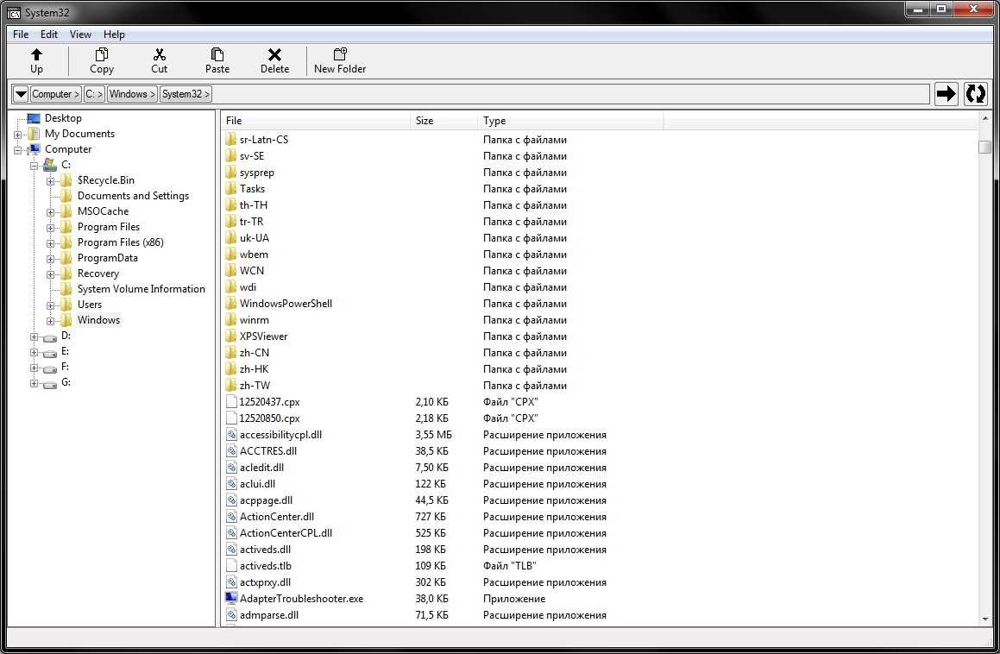

# Tiny File Manager
Lightweight file manager for Windows.

## System requirements
* Windows XP SP3 and newer
* Visual C++ Redistributable for Visual Studio 2015

## How to build
To build TFM you will need Visual Studio 2017 with following components installed:
* Desktop development with C++ workload
* Windows XP support for C++
* Windows Universal CRT SDK
* Windows 8.1 SDK (if resource compiler doesn't work correctly)
